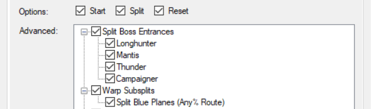
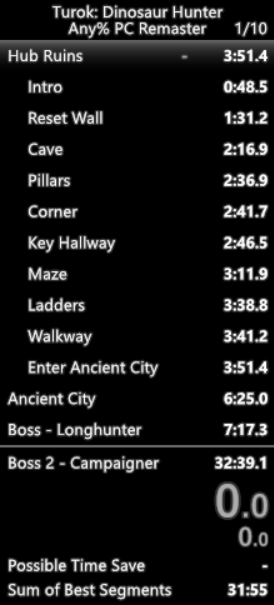
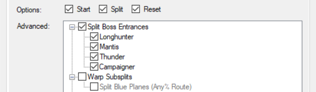
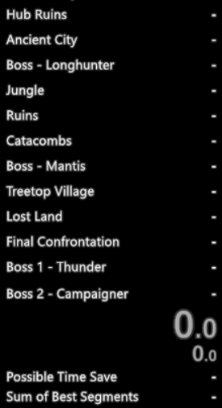
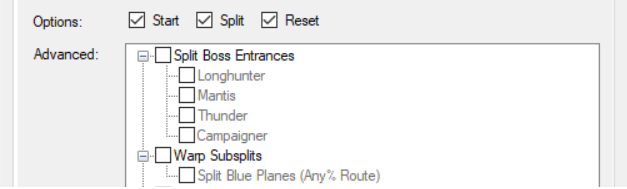
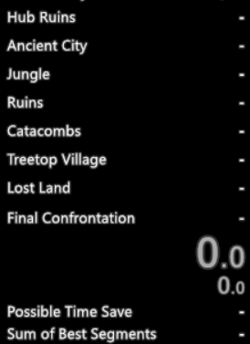

## LiveSplit Autosplitter for Turok: Dinosaur Hunter Remastered

Compatible with steam version 1.4.3 (fastest patch) and 2.0 (current patch)

Auto-start, auto-reset, splitting level entrances, splitting compaigner death, and optionally splitting boss entrances and blue warp planes (any% route only).

---

### Split Scheme - Detailed Subsplits

Needs 46 splits. [Download split template here](https://raw.githubusercontent.com/Glurmo/LiveSplit.ASL.Turok/master/turok-detailed-subsplits.lss)

For sub splits to work properly you need to use the "List -> Subsplits" component in your LiveSplit layout 

---

### Split Scheme - Levels + Bosses

Needs 12 splits, one for each level, one for each boss. [Download split template here](https://raw.githubusercontent.com/Glurmo/LiveSplit.ASL.Turok/master/turok-levels-bosses.lss)

--- 

### Split Scheme - Levels Only

Needs 8 splits, one for each level. [Download split template here](https://raw.githubusercontent.com/Glurmo/LiveSplit.ASL.Turok/master/turok-levels.lss)

---

If you have any questions you can PM me (glurmo#5946) on the Turok Discord; https://discord.gg/rcbPkSQ
